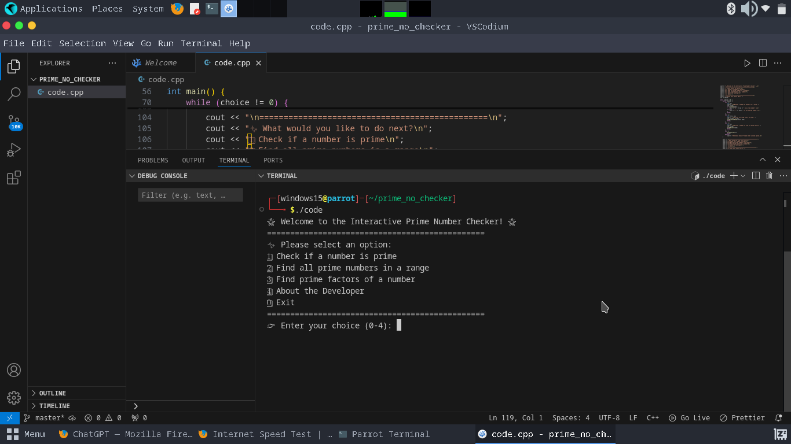
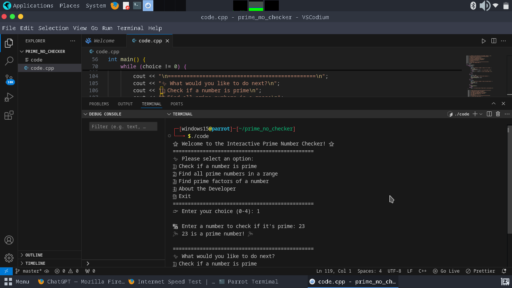
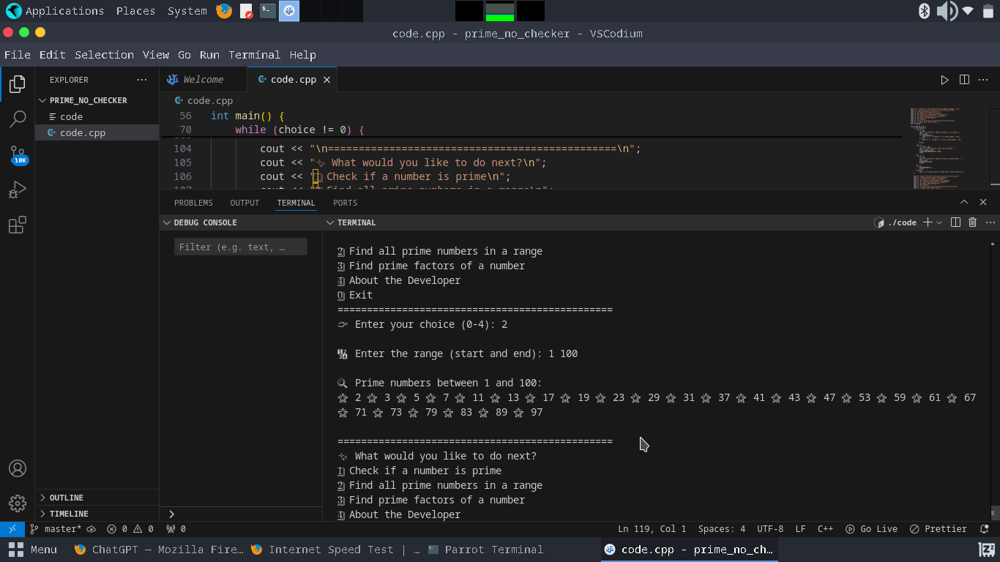
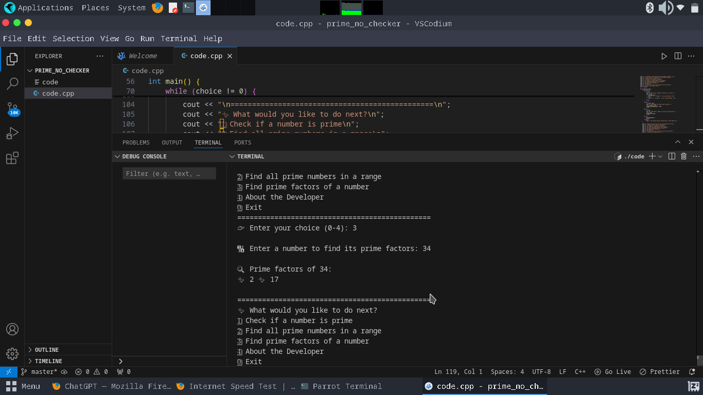
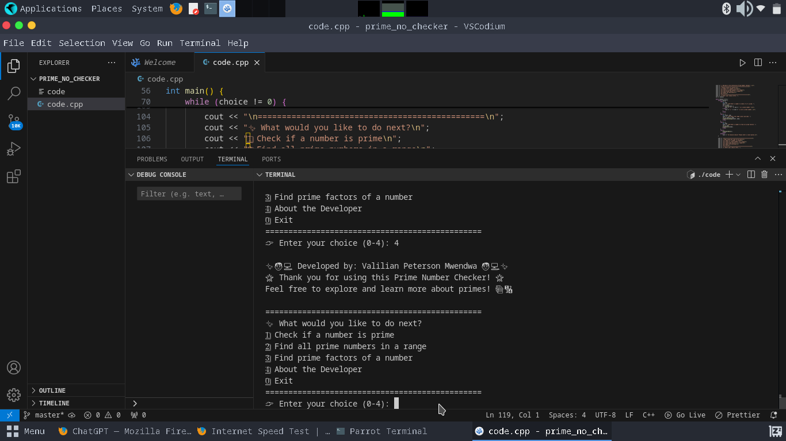

# 🌟 **Prime Number Checker** 🌟

Welcome to the **Prime Number Checker**! This is a fun, interactive C++ program that helps you explore prime numbers in an engaging and easy-to-use way. Whether you're learning about primes or just curious, this tool will help you check if a number is prime, find all prime numbers within a range, and even discover the prime factors of a number. Plus, it's full of cute emojis to make your experience enjoyable! 😊✨

---

## 📝 **Table of Contents**

1. [About the Project](#about-the-project)
2. [Features](#features)
3. [How to Run](#how-to-run)
4. [Screenshots](#screenshots)
5. [Code Structure](#code-structure)
6. [Credits](#credits)

---

## 🧐 **About the Project**

This project allows you to:

- **Check if a number is prime**: Learn whether a number is prime or not with a simple check. 🔍
- **Find prime numbers in a range**: Discover all the primes in any given range of numbers! 🌟
- **Prime Factorization**: Find the prime factors of any number! ✨

The user interface is interactive and visually appealing, with cute emojis throughout to keep things fun and engaging! 🌈

---

## 🚀 **Features**

- **1️⃣ Check if a number is prime**: Simply input a number, and the program will tell you whether it's prime. 🎉
- **2️⃣ Find all prime numbers in a range**: Enter a range (start and end), and it will list all the primes within that range. 🔢
- **3️⃣ Prime Factorization**: Get all the prime factors of a number. 💥
- **4️⃣ About the Developer**: Learn more about the creator of this project, **Valilian Peterson Mwendwa**. 👨‍💻
- **Easy-to-use menu**: Navigate the program with a simple, emoji-rich interface. 😄
- **Interactive and fun**: With every interaction, the program responds with excitement and cute emojis! 🎈

---

## 🏃‍♀️ **How to Run**

Follow these steps to run the program:

### 1. **Set Up Your Environment**

Make sure you have a C++ compiler installed (such as **g++**, **Code::Blocks**, **Visual Studio**, or **Xcode**).

### 2. **Save the Code**

Create a new C++ file (`PrimeNumberChecker.cpp`) and paste the provided code into it.

### 3. **Compile the Code**

- **Using Command Line (g++)**:
  - Open the terminal or command prompt and navigate to the folder where your file is located.
  - Run the command:.screenshot.screenshotss
  ```bash
  g++ PrimeNumberChecker.cpp -o PrimeNumberChecker
  ```
- **Using an IDE (like Code::Blocks or Visual Studio)**:
  - Click the "Build" or "Run" button.

### 4. **Run the Program**

- **Using Command Line (g++)**:
  - Run the program with:
  ```bash
  ./PrimeNumberChecker
  ```
- **Using an IDE**:
  - Simply press "Run" in the IDE.

### 5. **Interact with the Program**

- You will be prompted with a menu. Choose what you want to do by entering a number from the options list:
  1️⃣ Check if a number is prime  
   2️⃣ Find all prime numbers in a range  
   3️⃣ Find prime factors of a number  
   4️⃣ About the Developer  
   0️⃣ Exit

---

## 📸 **Screenshots**

Here are some screenshots to show how the program works:

### 1️⃣ **Main Menu**

This is the first screen you’ll see after launching the program. It presents the available options with cute emojis to choose from:


### 2️⃣ **Prime Check**

Once you select the option to check if a number is prime, you will be asked to enter a number. The result will show if it’s prime or not:


### 3️⃣ **Prime Numbers in a Range**

Select this option to find all prime numbers in a specific range. The program will list all primes in that range:


### 4️⃣ **Prime Factorization**

Here’s what the output looks like when you select the option to find prime factors of a number:


### 5️⃣ **Developer Credits**

When you choose the “About the Developer” option, you’ll get to know more about the developer:


---

## 📚 **Code Structure**

- **`isPrime(int n)`**: Checks if a number is prime by eliminating common divisors.
- **`findPrimesInRange(int start, int end)`**: Prints all primes in a given range.
- **`primeFactors(int n)`**: Prints all the prime factors of a given number.
- **`displayCredits()`**: Displays information about the project and the developer.
- **Main Menu**: Provides users with options to choose different actions.

---

## 🧑‍💻 **Credits**

✨ **Developed by: [Valilian Peterson Mwendwa](#)** ✨

Thank you for using this **Prime Number Checker**! I hope this tool helps you learn more about prime numbers while having some fun with interactive features and emojis. 🌈

If you enjoyed this project, feel free to explore and contribute! 💻🔧

---

## 💬 **Feedback**

I would love to hear your thoughts or suggestions! Please feel free to open an issue or pull request if you have any feedback. Let's make this project even better together! 🤝

---

🌟 **Happy Coding!** 🌟
